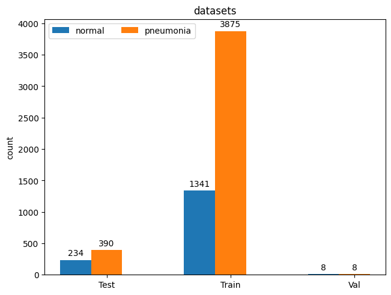
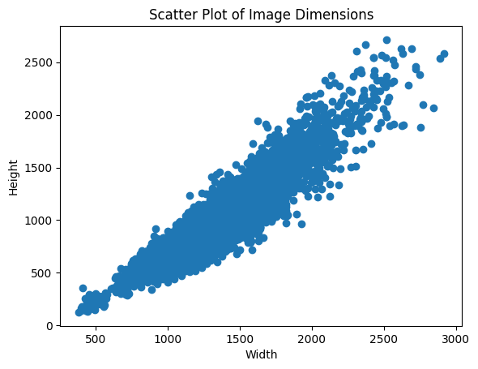
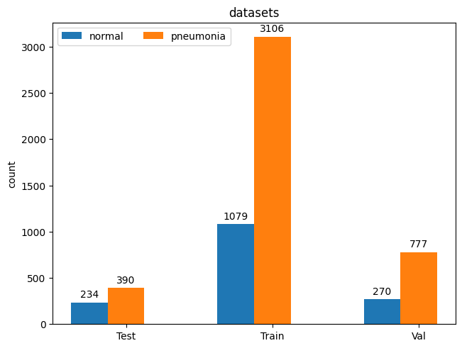

# Dataset Visualization 

This dataset have three list of data : 
    - test 
    - train 
    - val 
Each group have, normal and pneumonia jpeg images. 

## Distribution 
The dataset have many images in train and only nine images in val for each group.
For each group, especially in train dataset we have many data of pneumonia than normal.

## Images Size 
Each images have not the same size : 

## Image 
Each image is an radiography in grey color : 

# Pré processing 
before send to script we need : 
    - add more data in val dataset
    - resize all image in the same size 
    - transform images in 1d that tranform each pixel in suit of digits 

## distribution 
if we want to use val dataset, we need to put more data in it, from train dataset. 
We use train dataset because he have many data, than test. 

## resize 
Resizing data is needed because model could train on a dataset with the same size of features for each image. 
We can select a size less or more important to try to have more or less feature in dataset. 
Less feature could be good if we have over-fitting and more feature if we have under-fitting. 

## 1d image 
Before send dataset to model, we need to transform image in list of digits, order by pixel with value between 0 and 255 for each grey color in each pixel. model can predict data only with a floating point number. 

# Experience 